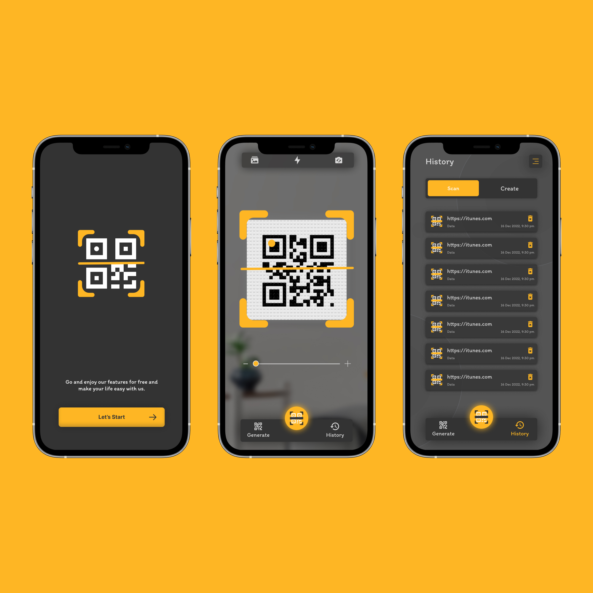

## ✨ Badges


---

## 📱 QR Code Scanner App (Flutter)

A powerful and easy-to-use **QR Code Scanner** app built with **Flutter**, featuring modern UI and essential functionality. This app allows users to scan QR codes instantly, view scan history, and generate new QR codes with custom data.

---

### ✨ Features

* 📷 **Scan QR Codes** in real-time using the device camera
* 🕓 **Scan History** to view previously scanned QR codes
* 📟 **Generate QR Codes** from custom text or links
* 💡 Supports **light/dark mode**
* 📂 **Locally stores** history using [Hive](https://pub.dev/packages/hive)
* ⚡ Fast performance and clean architecture using **Bloc/Cubit**

---

### 🧱 Project Structure

This project follows a Clean Architecture pattern:

```
lib/
🔗 core/         # Shared resources and helpers
🔗 features/
🔗 scan/     # Scan QR code logic
🔗 history/  # Scan history logic
🔗 generate/ # QR code generation
🔗 main.dart
```

---

### 🚀 Getting Started

To run this app locally:

```bash
git clone https://github.com/AmrSalahDev/qr_code_scanner_flutter.git
cd qr_code_scanner_flutter
flutter pub get
flutter run
```

---

## 📦 Dependencies Used

Below is a list of packages used in this Flutter project along with their versions:

### 🚀 Core
- `flutter`: Flutter SDK
- `cupertino_icons: ^1.0.8` – iOS-style icons

### 📦 State Management
- `flutter_bloc: ^9.1.1` – Bloc pattern for managing app state

### 🎨 UI Components
- `convex_bottom_bar: ^3.2.0` – Stylish bottom navigation bar
- `awesome_dialog: ^3.2.1` – Beautiful animated dialogs
- `flutter_styled_toast: ^2.2.1` – Customizable toast messages
- `flutter_svg: ^2.2.0` – SVG image rendering
- `omni_datetime_picker: ^2.1.1` – Date and time picker

### 🔄 Routing
- `go_router: ^16.0.0` – Declarative navigation

### 📷 Media & Camera
- `google_mlkit_barcode_scanning: ^0.14.1` – Barcode scanner using ML Kit
- `qr_code_scanner_plus: ^2.0.10+1` – QR code scanning
- `qr_flutter: ^4.1.0` – Generate QR codes
- `image_picker: ^1.1.2` – Pick images from gallery or camera
- `image_gallery_saver_plus: ^4.0.1` – Save images to gallery

### 📱 Native Features
- `android_intent_plus: ^5.3.0` – Send Android Intents
- `package_info_plus: ^8.3.0` – Get app package information
- `path_provider: ^2.1.5` – Access filesystem paths
- `permission_handler: ^12.0.1` – Request runtime permissions
- `vibration: ^3.1.3` – Control device vibration
- `wifi_iot: ^0.3.19+2` – Manage WiFi connections

### 💾 Data Storage
- `hive: ^2.2.3` – Lightweight key-value database
- `hive_flutter: ^1.1.0` – Hive integration with Flutter
- `hive_generator: ^2.0.1` – Code generation for Hive models

### 🧪 Code Generation & Utilities
- `build_runner: ^2.5.4` – Used for code generation
- `uuid: ^4.5.1` – Generate unique IDs
- `intl: ^0.20.2` – Internationalization and formatting
- `share_plus: ^11.0.0` – Share content with other apps

## 🎨 Figma Design

[View Figma Design](https://www.figma.com/community/file/1214837612730924876)


---

### 📸 Screenshots

> Add screenshots here (Scan page, History page, Generate page)



---

### 🛠️ Contributions

Feel free to fork the repo, open issues, or submit PRs to improve the app!
